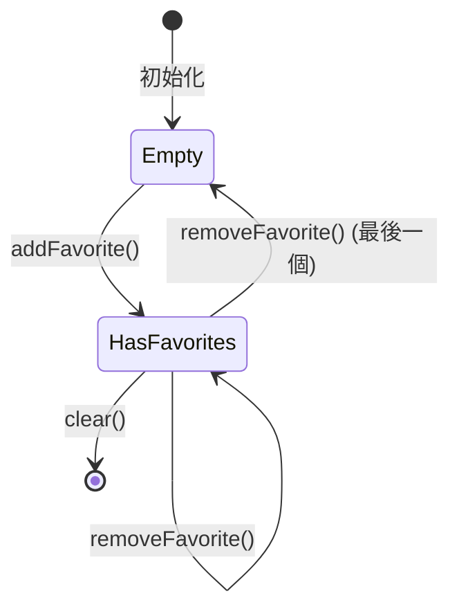
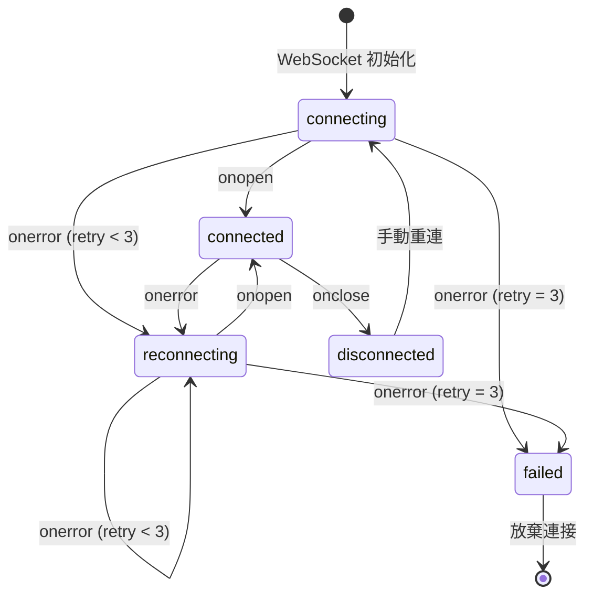
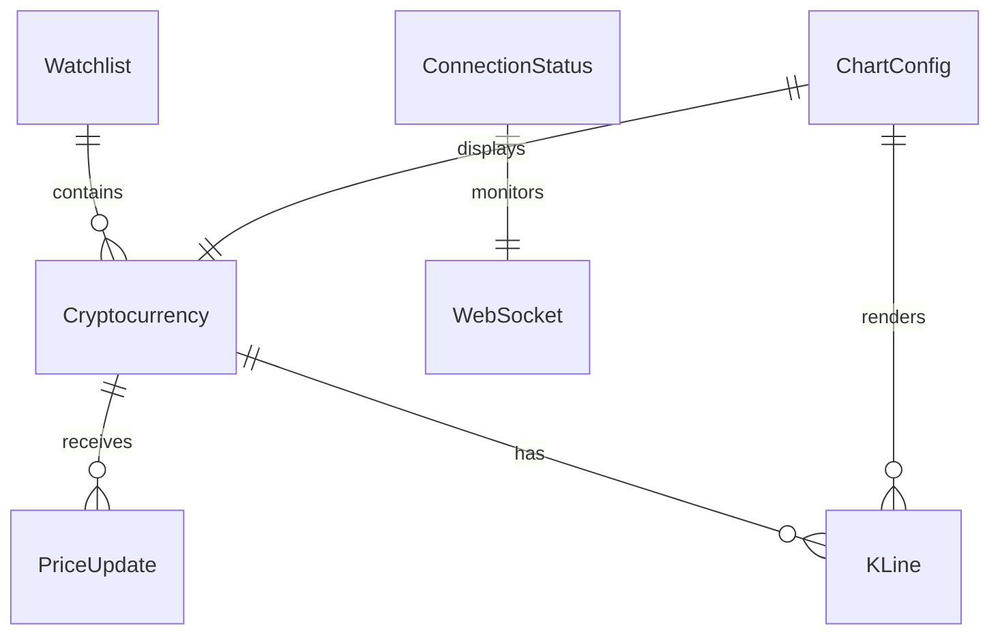
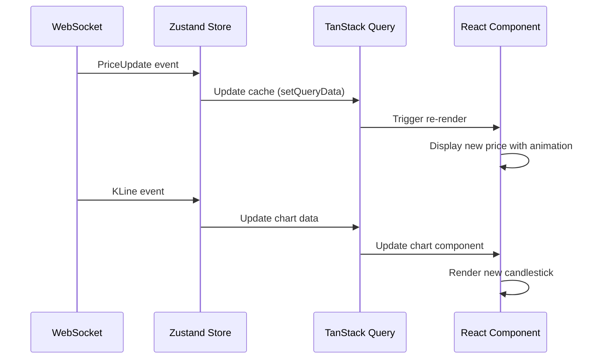

# Data Model: Crypto Realtime Dashboard

**Date**: 2025-10-31  
**Phase**: 1 - Design & Contracts  
**Status**: Complete

## Overview

本文件定義了 Crypto Realtime Dashboard 的資料模型,包括核心實體、屬性、關聯關係、驗證規則和狀態轉換。所有實體均從 `spec.md` 的 Key Entities 章節提取,並擴展了實作細節。

---

## 1. Cryptocurrency (加密貨幣)

代表單一加密貨幣及其即時市場資料。

### Properties

| 屬性名稱                | 型別     | 必填 | 說明                    | 驗證規則                |
| ----------------------- | -------- | ---- | ----------------------- | ----------------------- |
| `symbol`                | `string` | ✅   | 幣種代號 (如 `BTCUSDT`) | 大寫字母,長度 6-12 字元 |
| `baseAsset`             | `string` | ✅   | 基礎資產 (如 `BTC`)     | 大寫字母,長度 2-6 字元  |
| `quoteAsset`            | `string` | ✅   | 計價資產 (如 `USDT`)    | 大寫字母,長度 2-6 字元  |
| `displayName`           | `string` | ✅   | 顯示名稱 (如 `Bitcoin`) | 長度 1-50 字元          |
| `displayNameZh`         | `string` | ❌   | 中文名稱 (如 `比特幣`)  | 長度 1-20 字元          |
| `currentPrice`          | `number` | ✅   | 當前價格 (USDT)         | > 0                     |
| `priceChange24h`        | `number` | ✅   | 24小時價格變化 (USDT)   | 可正可負                |
| `priceChangePercent24h` | `number` | ✅   | 24小時漲跌幅百分比      | -100 ~ +∞               |
| `volume24h`             | `number` | ✅   | 24小時交易量            | ≥ 0                     |
| `marketCap`             | `number` | ❌   | 市值 (USDT)             | ≥ 0                     |
| `rank`                  | `number` | ❌   | 市值排名                | ≥ 1                     |
| `lastUpdateTime`        | `Date`   | ✅   | 最後更新時間            | ISO 8601 格式           |

### TypeScript Interface

```typescript
interface Cryptocurrency {
  symbol: string; // 'BTCUSDT'
  baseAsset: string; // 'BTC'
  quoteAsset: string; // 'USDT'
  displayName: string; // 'Bitcoin'
  displayNameZh?: string; // '比特幣'
  currentPrice: number; // 45678.90
  priceChange24h: number; // 1234.56 or -1234.56
  priceChangePercent24h: number; // 2.78 or -2.78
  volume24h: number; // 12345678900
  marketCap?: number; // 890000000000
  rank?: number; // 1
  lastUpdateTime: Date; // new Date()
}
```

### Validation Rules

```typescript
const cryptocurrencySchema = z.object({
  symbol: z.string().regex(/^[A-Z]{6,12}$/),
  baseAsset: z.string().regex(/^[A-Z]{2,6}$/),
  quoteAsset: z.string().regex(/^[A-Z]{2,6}$/),
  displayName: z.string().min(1).max(50),
  displayNameZh: z.string().min(1).max(20).optional(),
  currentPrice: z.number().positive(),
  priceChange24h: z.number(),
  priceChangePercent24h: z.number().min(-100),
  volume24h: z.number().nonnegative(),
  marketCap: z.number().nonnegative().optional(),
  rank: z.number().int().positive().optional(),
  lastUpdateTime: z.date(),
});
```

### Example

```json
{
  "symbol": "BTCUSDT",
  "baseAsset": "BTC",
  "quoteAsset": "USDT",
  "displayName": "Bitcoin",
  "displayNameZh": "比特幣",
  "currentPrice": 45678.9,
  "priceChange24h": 1234.56,
  "priceChangePercent24h": 2.78,
  "volume24h": 12345678900,
  "marketCap": 890000000000,
  "rank": 1,
  "lastUpdateTime": "2025-10-31T08:30:00.000Z"
}
```

---

## 2. PriceUpdate (價格更新事件)

代表 WebSocket 推送的即時價格更新事件。

### Properties

| 屬性名稱             | 型別                     | 必填 | 說明              | 驗證規則                |
| -------------------- | ------------------------ | ---- | ----------------- | ----------------------- |
| `symbol`             | `string`                 | ✅   | 幣種代號          | 大寫字母,長度 6-12 字元 |
| `price`              | `number`                 | ✅   | 最新價格          | > 0                     |
| `priceChange`        | `number`                 | ✅   | 價格變化量        | 可正可負                |
| `priceChangePercent` | `number`                 | ✅   | 漲跌幅百分比      | -100 ~ +∞               |
| `volume`             | `number`                 | ✅   | 成交量            | ≥ 0                     |
| `timestamp`          | `number`                 | ✅   | 事件時間戳記 (ms) | Unix timestamp          |
| `eventType`          | `'ticker' \| 'aggTrade'` | ✅   | 事件類型          | 'ticker' 或 'aggTrade'  |

### TypeScript Interface

```typescript
interface PriceUpdate {
  symbol: string;
  price: number;
  priceChange: number;
  priceChangePercent: number;
  volume: number;
  timestamp: number; // Unix timestamp in milliseconds
  eventType: "ticker" | "aggTrade";
}
```

### Validation Rules

```typescript
const priceUpdateSchema = z.object({
  symbol: z.string().regex(/^[A-Z]{6,12}$/),
  price: z.number().positive(),
  priceChange: z.number(),
  priceChangePercent: z.number().min(-100),
  volume: z.number().nonnegative(),
  timestamp: z.number().int().positive(),
  eventType: z.enum(["ticker", "aggTrade"]),
});
```

### Binance WebSocket Mapping

從 Binance WebSocket 24hr Ticker 訊息映射:

```typescript
// Binance 原始訊息
{
  "e": "24hrTicker",  // Event type
  "s": "BTCUSDT",     // Symbol
  "c": "45678.90",    // Close price (current)
  "p": "1234.56",     // Price change
  "P": "2.78",        // Price change percent
  "v": "123456.789",  // Total traded base asset volume
  "E": 1698765432000  // Event time
}

// 映射為 PriceUpdate
{
  symbol: "BTCUSDT",
  price: 45678.90,
  priceChange: 1234.56,
  priceChangePercent: 2.78,
  volume: 123456.789,
  timestamp: 1698765432000,
  eventType: "ticker"
}
```

---

## 3. KLine (K線/蠟燭線)

代表特定時間框架的蠟燭線資料。

### Properties

| 屬性名稱    | 型別                           | 必填 | 說明          | 驗證規則                |
| ----------- | ------------------------------ | ---- | ------------- | ----------------------- |
| `symbol`    | `string`                       | ✅   | 幣種代號      | 大寫字母,長度 6-12 字元 |
| `interval`  | `'1h' \| '4h' \| '1d' \| '1w'` | ✅   | 時間框架      | 枚舉值                  |
| `openTime`  | `number`                       | ✅   | 開盤時間 (ms) | Unix timestamp          |
| `closeTime` | `number`                       | ✅   | 收盤時間 (ms) | Unix timestamp          |
| `open`      | `number`                       | ✅   | 開盤價        | > 0                     |
| `high`      | `number`                       | ✅   | 最高價        | ≥ open                  |
| `low`       | `number`                       | ✅   | 最低價        | ≤ open                  |
| `close`     | `number`                       | ✅   | 收盤價        | > 0                     |
| `volume`    | `number`                       | ✅   | 成交量        | ≥ 0                     |
| `isFinal`   | `boolean`                      | ✅   | 是否已收盤    | true/false              |

### TypeScript Interface

```typescript
type KLineInterval = "1h" | "4h" | "1d" | "1w";

interface KLine {
  symbol: string;
  interval: KLineInterval;
  openTime: number;
  closeTime: number;
  open: number;
  high: number;
  low: number;
  close: number;
  volume: number;
  isFinal: boolean;
}
```

### Validation Rules

```typescript
const klineSchema = z
  .object({
    symbol: z.string().regex(/^[A-Z]{6,12}$/),
    interval: z.enum(["1h", "4h", "1d", "1w"]),
    openTime: z.number().int().positive(),
    closeTime: z.number().int().positive(),
    open: z.number().positive(),
    high: z.number().positive(),
    low: z.number().positive(),
    close: z.number().positive(),
    volume: z.number().nonnegative(),
    isFinal: z.boolean(),
  })
  .refine((data) => data.high >= data.low, {
    message: "High price must be >= low price",
  });
```

### Binance WebSocket Mapping

從 Binance WebSocket Kline 訊息映射:

```typescript
// Binance 原始訊息
{
  "e": "kline",
  "s": "BTCUSDT",
  "k": {
    "t": 1698761400000, // Kline start time
    "T": 1698765000000, // Kline close time
    "i": "1h",          // Interval
    "o": "45000.00",    // Open price
    "h": "45800.00",    // High price
    "l": "44900.00",    // Low price
    "c": "45678.90",    // Close price
    "v": "1234.567",    // Volume
    "x": false          // Is this kline closed?
  }
}

// 映射為 KLine
{
  symbol: "BTCUSDT",
  interval: "1h",
  openTime: 1698761400000,
  closeTime: 1698765000000,
  open: 45000.00,
  high: 45800.00,
  low: 44900.00,
  close: 45678.90,
  volume: 1234.567,
  isFinal: false
}
```

---

## 4. Watchlist (自選清單)

代表使用者收藏的幣種集合,持久化於 localStorage。

### Properties

| 屬性名稱      | 型別       | 必填 | 說明             | 驗證規則              |
| ------------- | ---------- | ---- | ---------------- | --------------------- |
| `favorites`   | `string[]` | ✅   | 收藏幣種代號陣列 | 每個元素為有效 symbol |
| `createdAt`   | `string`   | ✅   | 建立時間         | ISO 8601 格式         |
| `lastUpdated` | `string`   | ✅   | 最後更新時間     | ISO 8601 格式         |

### TypeScript Interface

```typescript
interface Watchlist {
  favorites: string[]; // ['BTCUSDT', 'ETHUSDT', 'BNBUSDT']
  createdAt: string; // ISO 8601 date string
  lastUpdated: string; // ISO 8601 date string
}
```

### Validation Rules

```typescript
const watchlistSchema = z.object({
  favorites: z.array(z.string().regex(/^[A-Z]{6,12}$/)).max(100),
  createdAt: z.string().datetime(),
  lastUpdated: z.string().datetime(),
});
```

### State Transitions



### Operations

```typescript
interface WatchlistOperations {
  addFavorite(symbol: string): void;
  removeFavorite(symbol: string): void;
  isFavorite(symbol: string): boolean;
  clear(): void;
}
```

### localStorage Storage

```typescript
// Key: 'crypto-watchlist'
// Value: JSON string of Watchlist

// Example stored value
{
  "favorites": ["BTCUSDT", "ETHUSDT", "BNBUSDT"],
  "createdAt": "2025-10-31T08:00:00.000Z",
  "lastUpdated": "2025-10-31T08:30:00.000Z"
}
```

---

## 5. ConnectionStatus (連線狀態)

代表 WebSocket 連接的即時狀態。

### Properties

| 屬性名稱        | 型別              | 必填 | 說明              | 驗證規則       |
| --------------- | ----------------- | ---- | ----------------- | -------------- |
| `status`        | `ConnectionState` | ✅   | 連線狀態          | 枚舉值         |
| `error`         | `string \| null`  | ✅   | 錯誤訊息          | null 或字串    |
| `lastConnected` | `Date \| null`    | ✅   | 最後連接時間      | null 或 Date   |
| `retryCount`    | `number`          | ✅   | 重試次數          | 0-3            |
| `retryDelay`    | `number`          | ✅   | 下次重試延遲 (ms) | 1000/2000/4000 |

### TypeScript Interface

```typescript
type ConnectionState =
  | "connecting" // 正在連接
  | "connected" // 已連接
  | "disconnected" // 已斷開
  | "reconnecting" // 重新連接中
  | "failed"; // 連接失敗 (達到最大重試次數)

interface ConnectionStatus {
  status: ConnectionState;
  error: string | null;
  lastConnected: Date | null;
  retryCount: number;
  retryDelay: number;
}
```

### State Transitions



### Retry Logic

```typescript
const RETRY_DELAYS = [1000, 2000, 4000]; // 指數退避

function getRetryDelay(retryCount: number): number {
  return RETRY_DELAYS[Math.min(retryCount, RETRY_DELAYS.length - 1)];
}

// Example:
// retryCount = 0 → delay = 1000ms
// retryCount = 1 → delay = 2000ms
// retryCount = 2 → delay = 4000ms
// retryCount = 3+ → 放棄 (status = 'failed')
```

---

## 6. ChartConfig (圖表配置)

代表 K 線圖表的顯示配置。

### Properties

| 屬性名稱     | 型別                | 必填 | 說明           | 驗證規則               |
| ------------ | ------------------- | ---- | -------------- | ---------------------- |
| `symbol`     | `string`            | ✅   | 當前顯示幣種   | 有效 symbol            |
| `interval`   | `KLineInterval`     | ✅   | 當前時間框架   | '1h', '4h', '1d', '1w' |
| `theme`      | `'light' \| 'dark'` | ✅   | 圖表主題       | 'light' 或 'dark'      |
| `showVolume` | `boolean`           | ✅   | 是否顯示成交量 | true/false             |
| `showGrid`   | `boolean`           | ✅   | 是否顯示網格線 | true/false             |

### TypeScript Interface

```typescript
interface ChartConfig {
  symbol: string;
  interval: KLineInterval;
  theme: "light" | "dark";
  showVolume: boolean;
  showGrid: boolean;
}
```

### Default Configuration

```typescript
const DEFAULT_CHART_CONFIG: ChartConfig = {
  symbol: "BTCUSDT",
  interval: "1d",
  theme: "light",
  showVolume: true,
  showGrid: true,
};
```

---

## Entity Relationships



**關係說明**:

- 一個 `Cryptocurrency` 可接收多個 `PriceUpdate` (即時更新)
- 一個 `Cryptocurrency` 可有多個 `KLine` (不同時間框架)
- 一個 `Watchlist` 可包含多個 `Cryptocurrency` (收藏清單)
- 一個 `ConnectionStatus` 監控一個 WebSocket 連接
- 一個 `ChartConfig` 顯示一個 `Cryptocurrency` 的 K 線圖表

---

## Data Flow



---

## Summary

本文件定義了 6 個核心實體:

1. **Cryptocurrency**: 加密貨幣主實體
2. **PriceUpdate**: 即時價格更新事件
3. **KLine**: K 線蠟燭線資料
4. **Watchlist**: 自選收藏清單
5. **ConnectionStatus**: WebSocket 連線狀態
6. **ChartConfig**: 圖表顯示配置

所有實體均包含完整的 TypeScript 介面定義、驗證規則、範例資料和狀態轉換邏輯。資料模型已準備好用於 API 合約設計和前端實作。
